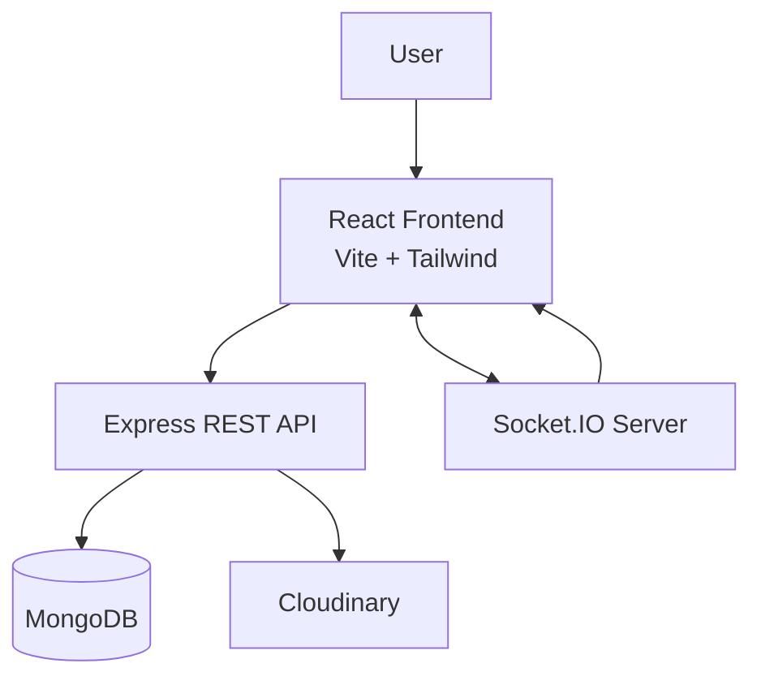

# MarcoC

**MarcoC** is a real-time chat application built with the MERN stack.

It supports user accounts, private messaging, real-time message delivery, online-user status, profile pictures, emoji input, and a chat dashboard.

The project is complete enough to run locally on a computer with MongoDB and the required Cloudinary credentials.

## What MarcoC Does

The basic idea is simple:

```text
Create Account
      ↓
Login
      ↓
See other users
      ↓
Open a chat
      ↓
Send message
      ↓
Message is stored in MongoDB
      ↓
Socket.IO sends it in real time
      ↓
Receiver sees the message
```

## Features

- User signup
- User login
- Password hashing with bcrypt
- JWT authentication
- Protected routes
- View other registered users
- One-to-one messaging
- Messages stored in MongoDB
- Real-time messages with Socket.IO
- Online user tracking
- Message delivery event
- Profile information
- Profile picture upload
- Cloudinary image storage
- Emoji picker
- Responsive chat interface

## Architecture



### Simple Explanation

There are two main ways the frontend talks to the backend.

**Normal API requests**

Used for things such as:

- Signup
- Login
- Getting users
- Getting old messages
- Saving a message
- Updating a profile
- Uploading a profile picture

```text
React
  ↓
Express API
  ↓
MongoDB / Cloudinary
```

**Real-time communication**

Used for things that should happen immediately:

```text
React
  ↕
Socket.IO
  ↕
Node.js Server
```

This allows messages and online-user changes to appear without refreshing the page.

## Tech Stack

### Frontend

- React
- Vite
- Tailwind CSS
- React Router
- Axios
- Socket.IO Client
- Emoji Picker React

### Backend

- Node.js
- Express
- MongoDB
- Mongoose
- Socket.IO
- JWT
- bcryptjs
- Multer
- multer-storage-cloudinary
- Cloudinary
- CORS
- dotenv

## Project Structure

```text
chat-app/
│
├── backend/
│   ├── config/
│   │   ├── cloudinary.js
│   │   └── db.js
│   │
│   ├── controllers/
│   │   ├── authController.js
│   │   ├── messageController.js
│   │   └── userController.js
│   │
│   ├── middleware/
│   │   ├── authMiddleware.js
│   │   └── upload.js
│   │
│   ├── models/
│   │   ├── messageModel.js
│   │   └── userModel.js
│   │
│   ├── routes/
│   │   ├── authRoutes.js
│   │   ├── messageRoutes.js
│   │   └── userRoutes.js
│   │
│   ├── socket/
│   │   └── socket.js
│   │
│   └── server.js
│
└── frontend/
    ├── src/
    │   ├── assets/
    │   ├── components/
    │   ├── pages/
    │   │   ├── Login.jsx
    │   │   ├── Signup.jsx
    │   │   └── dashboard.jsx
    │   │
    │   ├── api.js
    │   ├── socket.js
    │   ├── App.jsx
    │   ├── main.jsx
    │   └── index.css
    │
    ├── package.json
    ├── tailwind.config.js
    └── vite.config.js
```

## Backend

The backend is split into controllers, routes, models, middleware, configuration, and Socket.IO logic.

### Authentication

The authentication system uses:

- bcrypt for password hashing
- JWT for authentication

Signup:

```text
POST /api/auth/signup
```

Login:

```text
POST /api/auth/login
```

After successful login, the server returns a JWT token.

The frontend keeps the logged-in user information in `sessionStorage` and sends the token with protected API requests.

## Protected Routes

The backend has an authentication middleware.

It reads:

```text
Authorization: Bearer <token>
```

The token is verified with the JWT secret.

After verification, the user's ID is placed on the request and protected controllers can use it.

This is used for user and message routes.

## Users

The user model stores:

```text
name
email
password
profilePicture
createdAt
updatedAt
```

Users can be retrieved without exposing their password.

The backend also provides:

```text
GET /api/users
GET /api/users/:id
PUT /api/users/profile
POST /api/users/upload
```

The current user is excluded when loading the list of other users.

## Profile Pictures

Profile images are uploaded through Multer and stored using Cloudinary.

Flow:

```text
User selects image
       ↓
React
       ↓
POST /api/users/upload
       ↓
Multer
       ↓
Cloudinary
       ↓
Image URL returned
       ↓
Profile updated
```

The upload middleware uses a Cloudinary storage configuration and places images in:

```text
chat-app-images
```

## Messages

The message model stores:

```text
sender
receiver
text
messageType
delivered
createdAt
updatedAt
```

Supported message types are:

```text
text
image
```

The current HTTP message controller provides:

```text
POST /api/messages
GET /api/messages/:userId
```

### Send a Message

The sender's ID comes from the authenticated request.

The backend creates a message and saves it to MongoDB.

```text
Frontend
   ↓
POST /api/messages
   ↓
Auth Middleware
   ↓
Message Controller
   ↓
MongoDB
```

### Get Chat History

For a selected user, the backend searches both directions:

```text
sender = current user AND receiver = selected user
```

or

```text
sender = selected user AND receiver = current user
```

The messages are returned in creation order.

## Real-Time Messaging

MarcoC uses **Socket.IO** for real-time communication.

The server keeps a simple mapping between:

```text
userId → socketId
```

When a user connects, the frontend registers the user's ID with the socket server.

The server then knows which socket belongs to which user.

### Message Flow

```text
Sender
  ↓
Socket.IO
  ↓
Find receiver's socket
  ↓
Send receive_message event
  ↓
Receiver
```

The server also emits a delivery event back to the sender:

```text
message_delivered
```

This gives the application a basic message-delivery flow.

## Online Users

Socket.IO also keeps track of connected users.

When a user connects:

```text
register
```

When a user disconnects, their socket mapping is removed.

The server broadcasts:

```text
online_users
```

This lets the frontend know which users are currently online.

## Frontend

The frontend is a React application created with Vite.

Main screens:

```text
Login
Signup
Dashboard
```

The dashboard contains the main chat experience.

### Protected Route

The frontend includes:

```text
ProtectedRoute.jsx
```

The dashboard route is wrapped with this component so unauthenticated users cannot directly access the main chat page.

## API Connection

The frontend uses Axios.

The main API client points to:

```text
http://localhost:5050/api
```

The Axios interceptor automatically reads the logged-in user from:

```text
sessionStorage
```

and attaches the JWT token to protected requests.

## Socket Connection

The frontend creates a Socket.IO client connection to:

```text
http://localhost:5050
```

The same backend server handles both:

- Express HTTP routes
- Socket.IO real-time events

## Database

MarcoC uses MongoDB with Mongoose.

There are two main collections:

```text
Users
Messages
```

### User

```text
name
email
password
profilePicture
timestamps
```

### Message

```text
sender
receiver
text
messageType
delivered
timestamps
```

The backend connects to MongoDB during startup using:

```text
MONGO_URL
```

## Environment Variables

Create:

```text
backend/.env
```

Example:

```env
PORT=5050
MONGO_URL=your_mongodb_connection_string
JWT_SECRET=your_jwt_secret

CLOUD_NAME=your_cloudinary_cloud_name
CLOUD_API_KEY=your_cloudinary_api_key
CLOUD_API_SECRET=your_cloudinary_api_secret
```

Keep these values private.

Do not commit real secrets to GitHub.

## Running MarcoC Locally

### 1. Clone the repository

```bash
git clone https://github.com/Rohitrajashekhar22/chat-app.git
cd chat-app
```

### 2. Start the backend

```bash
cd backend
npm install
npm run dev
```

The backend runs on:

```text
http://localhost:5050
```

### 3. Start the frontend

Open another terminal:

```bash
cd frontend
npm install
npm run dev
```

Vite will show the local frontend URL.

Open that URL in your browser.

## Full Local Flow

```text
Browser
   ↓
React + Vite
   ↓
Express API ─────────→ MongoDB
   │
   ├───────────────→ Cloudinary
   │
   └───────────────→ Socket.IO
                         ↓
                    Other Users
```

## Why Socket.IO?

Normal HTTP requests are useful for saving and loading data, but a chat application also needs instant updates.

Socket.IO is used here so that:

- messages can arrive in real time
- online users can be updated
- delivery events can be sent
- the page does not need to refresh for every message

The project uses HTTP and Socket.IO together rather than trying to use only one of them.

## Current Message Design

A message can be marked as:

```text
text
```

or:

```text
image
```

The database model supports both types.

The current main chat flow is centered around text messages, while image handling is supported by the data model and upload infrastructure.

## Extra Development File

The backend also contains:

```text
backend/test.html
```

This is a small Socket.IO testing page used during development.

It is not the main application interface.

## Notes

The repository currently contains installed dependency files under `backend/node_modules`.

These are generated files and normally should not be committed to a Git repository. A fresh clone should install dependencies with:

```bash
npm install
```

rather than relying on the committed `node_modules` directory.

## What I Learned From This Project

This project covers several important full-stack concepts:

- Building a MERN application
- REST API design
- Authentication with JWT
- Password hashing
- MongoDB data modeling
- Protected API routes
- File uploads
- Cloudinary storage
- Real-time communication
- Socket.IO events
- React routing
- Frontend API integration
- Handling both HTTP and WebSocket-style communication

## License

This project is created for learning and development purposes.
